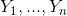
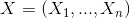
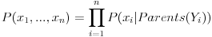
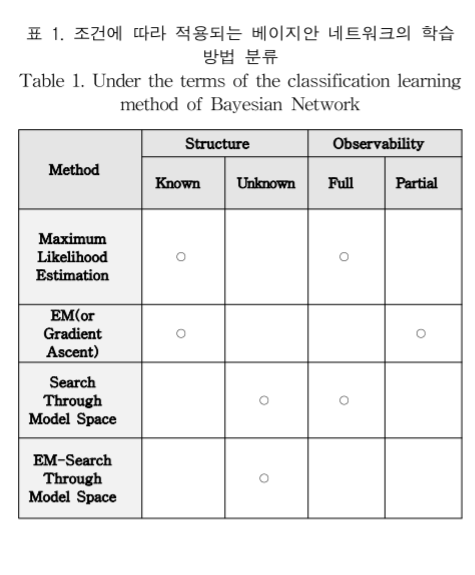

## 9. 클래스 분류 : 고급 기법
### 9.1 베이지안 신뢰 네트워크
8장에서 베이즈 이론과 나이브 베이지안 분류자를 배웠는데, 클래스 조건부 독립성(하나의 속성 값이 튜플의 라벨 결정에 대해 다른 속성의 영향을 받지 않는다는 것. 즉 속성 사이에 의존 관계가 없다.)을 전제하는 나이브 베이지안 분류자와 달리, 베이지안 신뢰 네트워크는 속성간의 의존성을 허용한다.

#### 베이지안 신뢰 네트워크(Bayesian belief networks)란?
신뢰 네트워크, 베이지안 네트워크 확률, 확률 네트워크라고도 불린다. 위에서 언급했듯, 나이브 베이지안 분류자는 속성 간의 독립성을 가정으로 하여 계산된다. 그러나 현실에서는 속상간의 연관성이 존재할 확률이 높다. 베이지안 신뢰 네트워크는 **연결 조건 확률 분포를 특정해서 이 문제를 해결한다.**

신뢰 네트워크의 중요한 점은 2가지로 생각되는데,  
1. **속성 대신 속성의 부분집합을 확률변수로 삼아서 조건부 독립성을 만족**시킨다.
2. 미특정 관계의 연결된 그래프 형태의 모델로 학습과정에서 **연결을 확정지어나간다**.

먼저, 신뢰 네트워크가 어떻게 생겼는지 보자. 신뢰 네트워크 = 그래프 + 조건부 확률표

1. 방향성은 있지만 순환하지 않는 그래프
그래프의 노드는 변수를 의미한다. 화살표는 부모-자식 관계의 의존 관계를 나타내는데, '가족력'에서 '폐암'으로 화살표가 향하는 것을 보아 '가족력'은 '폐암' 변수의 부모이고 '폐암' 변수는 '가족력'변수 자식이다. 여기서 중요한 점은, 부모-자식 관계가 아니라면 두 노드는 독립이라는 점이다. 예를 들면, 환자의 폐암 여부를 알고있다면 X레이 양성 변수는 환자의 가족력과 흡연 여부와 독립이다. 폐암 변수와 천식 변수도 독립이다. 이게 위에서 말한 '속성의 부분집합을 확률 변수로 삼아 조건부 독립성을 만족시킨다'는 말이다. 부모 노드의 여부를 알고 있다면 부모-자식 관계가 아닌 노드들은 조건부 독립성을 만족한다.
2. 조건부 확률표(CPT;Conditional Probability Table)
변수(노드) Y의 CPT는 P(Y|Parents(Y))이다. (b)를 참고하여 폐암여부를 변수로 예를 들자면, P(폐암=yes | 가족력=yes, 흡연=yes) = 0.8이다.

베이지안 신뢰 네트워크는 연결 조건 확률 분포를 가진다고 했는데, 어떻게 계산할 수 있는지 보자.
어떤 데이터 튜플이 속성  에 대해 의 값을 갖고 있다고 하자. 그렇다면 튜플의 연결 확률 분포는 아래 식과 같다.

신뢰 네트워크 그래프 상에서 직접 연결로 부모-자식 관계가 아닌 변수들이 상호 독립적이라는 사실로 위 식이 도출된다.

베이지안 신뢰 네트워크는 여러 문제의 모델을 수립해왔는데, 유전자 연결 분석, 컴퓨터 비전(이미지 복원, 다중 시각 등), 문서와 텍스트 분석, 의사결정 지원 시스템, 민감성 분석 등이 있다고 한다.

#### 신뢰 네트워크 훈련
베이지안 신뢰 네트워크는 그래프와 CPT로 이루어진다고 했다. 따라서 신뢰 네트워크 학습의 종류에는 2가지가 있다.
1. 그래프 -> 네트워크의 위상을 구성하는 구조 학습(structure learning)
그래프를 결정하는 것은 네트워크의 위상을 구성하는 과정이다. 즉, 노드와 연결선의 배치를 결정하는 것인데, 모델링을 하기 전 변수를 발견하고 의존관계를 파악하는 것과 같은 과정이다. 책에서는 비즈니스 지식이나 데이터 관찰을 통해 구성하라고 설명한다.
2. CPT -> CPT를 구성하는 파라미터 학습(parameter learning)
의존 관계가 있는 노드의 조건부 확률값을 모두 안다면 계산하여 CPT표를 채우면 되지만 모른다면 training set을 통해 훈련하여 각 노드의 확률을 구한다.
1, 2번 조건에 따라 베이지안 네트워크 학습 방법이 달라지는데, 다음 표와 같다고 한다. [참고](https://pdfs.semanticscholar.org/b37e/c9eb6837e44d9a4518ec5677b42f7d385124.pdf)

